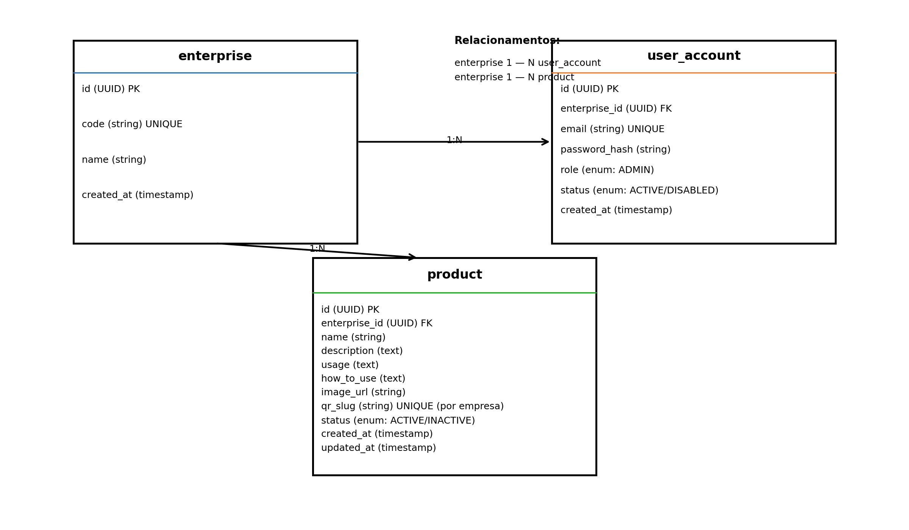

# SmartQR Backend (MVP)

Backend do **SmartQR**: um catálogo de produtos acessado por **QR Code**.
A leitura do QR abre uma URL do tipo `/api/public/products/{qrSlug}` e o backend retorna os dados do produto (imagem, descrição, utilização e modo de uso).

> Documento/README gerado em **2025-12-30**.

## Tecnologias
- **Java 17/21** + **Spring Boot 3.x**
- **Spring Web** (REST)
- **Spring Data JPA** (persistência)
- **PostgreSQL**
- **Flyway** (migrations)
- **Bean Validation** (`jakarta.validation`)
- **Docker / Docker Compose**
- (Opcional na Sprint 2) **Spring Security + JWT** (Admin)

## Contexto da aplicação
No varejo/estoque, é comum o atendente não ter todas as informações do produto.
O SmartQR resolve isso colocando um **QR Code no produto**, apontando para uma rota pública que exibe as informações de forma rápida e padronizada.

## Modelo de dados (MVP)
Abaixo está o esquema mínimo sugerido (**sem DDL**, só estrutura).



**Relações:**
- `enterprise` **1:N** `user_account`
- `enterprise` **1:N** `product`

## Fluxo público (QR Code)


## Rotas da API

### Convenções
- Datas em ISO-8601 (ex.: `2025-12-30T10:30:00Z`)
- Listas sempre paginadas (`page`, `size`, `sort`)

---

## Rotas públicas (sem login)

### 1) Listar produtos (paginado)
`GET /api/public/products?page=0&size=12&sort=createdAt,desc`

**Retorno (200)**
```json
{
  "content": [
    {
      "id": "uuid",
      "qrSlug": "farinha-trigo-1kg",
      "name": "Farinha de Trigo 1kg",
      "imageUrl": "https://...",
      "status": "ACTIVE"
    }
  ],
  "pageable": {
    "pageNumber": 0,
    "pageSize": 12
  },
  "totalElements": 120,
  "totalPages": 10
}
```

### 2) Detalhe do produto por QR Slug
`GET /api/public/products/{qrSlug}`

Ex.: `/api/public/products/farinha-trigo-1kg`

**Retorno (200)**
```json
{
  "id": "uuid",
  "qrSlug": "farinha-trigo-1kg",
  "name": "Farinha de Trigo 1kg",
  "description": "Descrição do produto...",
  "usage": "Para que serve / onde usar...",
  "howToUse": "Modo de uso...",
  "imageUrl": "https://...",
  "status": "ACTIVE",
  "updatedAt": "2025-12-30T10:30:00Z"
}
```

**Erros comuns**
- `404` se o `qrSlug` não existir
- `410` (opcional) se o produto estiver `INACTIVE` e você quiser diferenciar de 404

---

## Rotas administrativas (com login) *(Sprint 1 ou Sprint 2)*
> Sugestão: colocar essas rotas atrás de JWT (ADMIN).

### 3) Criar produto
`POST /api/admin/products`

**Body**
```json
{
  "name": "Farinha de Trigo 1kg",
  "qrSlug": "farinha-trigo-1kg",
  "description": "Descrição...",
  "usage": "Utilização...",
  "howToUse": "Modo de uso...",
  "imageUrl": "https://...",
  "status": "ACTIVE"
}
```

**Retorno (201)**
```json
{
  "id": "uuid",
  "name": "Farinha de Trigo 1kg",
  "qrSlug": "farinha-trigo-1kg",
  "status": "ACTIVE",
  "createdAt": "2025-12-30T10:30:00Z"
}
```

### 4) Atualizar produto
`PUT /api/admin/products/{id}`

**Body** (mesmos campos do create)
```json
{
  "name": "Farinha de Trigo 1kg (nova)",
  "description": "....",
  "usage": "....",
  "howToUse": "....",
  "imageUrl": "https://...",
  "status": "ACTIVE"
}
```

**Retorno (200)**
```json
{
  "id": "uuid",
  "name": "Farinha de Trigo 1kg (nova)",
  "status": "ACTIVE",
  "updatedAt": "2025-12-30T10:35:00Z"
}
```

### 5) Listar produtos (admin)
`GET /api/admin/products?page=0&size=20`

### 6) Deletar produto
`DELETE /api/admin/products/{id}`

Retorno:
- `204 No Content`

---

## Autenticação (Admin) *(Sprint 2 sugerida)*

### Login
`POST /api/auth/login`

**Body**
```json
{
  "email": "admin@empresa.com",
  "password": "senha"
}
```

**Retorno (200)**
```json
{
  "accessToken": "jwt...",
  "tokenType": "Bearer",
  "expiresIn": 3600
}
```

---

## Estrutura de pastas (sugerida)
```text
src/main/java/br/com/smartqr
  config
  controllers
    publicapi
    admin
    auth
  dto
    request
    response
  entities
  repositories
  services
  exceptions
```
Dica: separar controllers por `publicapi` e `admin` mantém o contrato da API claro e evita “misturar” endpoints públicos com endpoints protegidos.

## Configuração (env)
Sugestão de variáveis:
- `SPRING_DATASOURCE_URL`
- `SPRING_DATASOURCE_USERNAME`
- `SPRING_DATASOURCE_PASSWORD`
- `SPRING_JPA_HIBERNATE_DDL_AUTO=validate`
- `SPRING_FLYWAY_ENABLED=true`
- (Sprint 2) `JWT_SECRET`, `JWT_EXP_SECONDS`

## Como rodar com Docker Compose (exemplo)
1. Configure um `.env` (baseado em `.env.example`)
2. Suba o stack:
```bash
docker compose up --build
```

## Próximos passos (depois do MVP)
- IA (gerar `description/usage/howToUse` no Admin)
- Tabela `product_image` (múltiplas imagens)
- Auditoria (quem alterou o produto)
- Observabilidade (Actuator + métricas + tracing)
